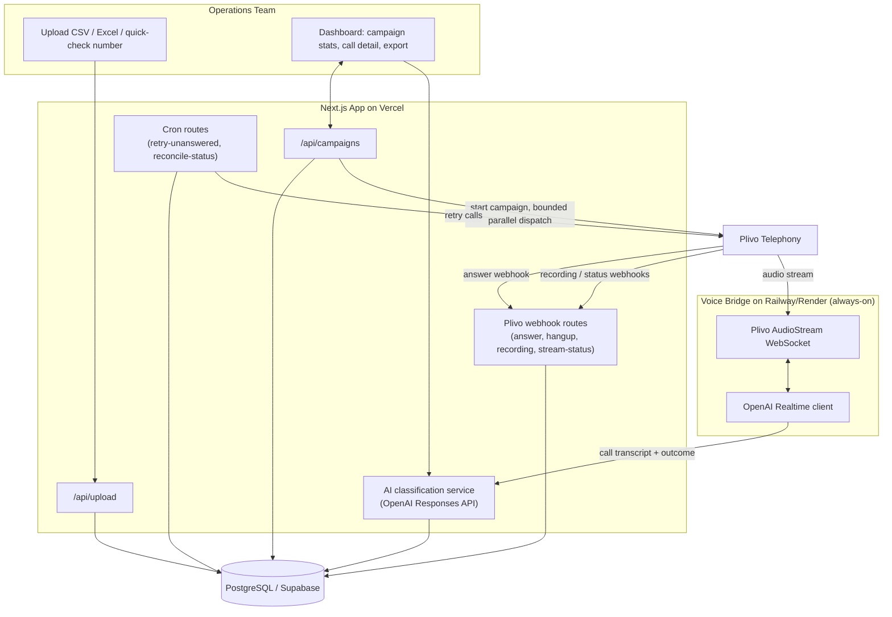

# eDial — Outbound AI Calling Agent

An AI voice agent that calls hundreds of contacts in parallel, has a real Hindi-first conversation about pickup/de-installation readiness, and hands operations teams a clean spreadsheet of results — no manual dialing required.

## Overview

Operations and logistics teams in India often work from an Excel or CSV sheet of phone numbers, manually calling each contact to check if equipment is ready for pickup or an engineer needs to de-install it. That process is slow, inconsistent, hard to audit, and painful to run across multiple Indian languages.

eDial (built as a hackathon MVP for the OpenAI Outskill Hackathon) automates that workflow end to end: upload a contact sheet, launch a campaign, and the app places bounded batches of outbound calls through a real telephony provider (Plivo). A live OpenAI Realtime voice agent — Hindi-first, with English and other Indian language packs — asks whether the pickup/de-installation is ready, listens for yes/no/unclear responses, and follows up when needed. Every call is recorded, transcribed, summarized, and classified into a business outcome (confirmed, declined, follow-up needed, etc.), and the results — original sheet columns plus AI-enriched call data — are exportable as a single CSV for the operations team to act on.

## Key Features

- **Bulk contact upload** — import contacts from CSV or Excel (`.xlsx`), a pasted list, or a single quick-check number; validates, normalizes, and de-duplicates rows while preserving every original column.
- **Parallel outbound calling** — dispatches calls in configurable concurrency batches (default 5 at a time) instead of dialing one contact at a time.
- **Live AI voice agent** — powered by the OpenAI Realtime API, Hindi-first with English fallback and scripted support for 10 additional Indian languages (Bengali, Punjabi, Gujarati, Marathi, Tamil, Telugu, Malayalam, Kannada, Odia, Assamese).
- **Provider-agnostic telephony** — a shared adapter interface with Plivo fully implemented and Twilio/Exotel scaffolded for future providers.
- **Automatic call classification** — OpenAI Responses API summarizes transcripts, detects language, and extracts a disposition (`confirmed_pickup`, `declined`, `follow_up_needed`, `manual_review`, etc.), with a deterministic rule-based fallback when the API is unavailable.
- **Retry scheduling** — unanswered, failed, or not-connected calls are automatically retried up to a configurable limit.
- **Operations dashboard** — live campaign stats, per-call detail (recording, transcript, summary, next action), and filtering.
- **CSV export** — download an operations-ready file that keeps every uploaded column and appends call status, disposition, recording link, summary, and next action.
- **Simulated demo mode** — campaigns can run against simulated provider callbacks so the product is demoable even without live telephony credentials.
- **Session-based authentication** — simple admin/read-only login gate protecting campaign write routes.

## Tech Stack

- **Framework**: Next.js 15 (App Router) + React 19, TypeScript
- **Styling**: Tailwind CSS
- **Database**: PostgreSQL / Supabase
- **Telephony**: Plivo (adapter interface also scaffolds Twilio and Exotel)
- **Voice AI**: OpenAI Realtime API (live conversation) + OpenAI Responses API (transcript summarization, disposition classification)
- **Voice bridge**: standalone Node/TypeScript WebSocket server (`src/voice-bridge`) relaying audio between Plivo AudioStream and OpenAI Realtime, run with `tsx`
- **Validation**: Zod
- **File parsing**: `csv-parse`, `read-excel-file`
- **Testing**: Vitest (unit/integration), Playwright patterns for e2e
- **Deployment targets**: Vercel (Next.js app, API routes, webhooks, cron), Railway or Render (always-on voice bridge process), Supabase (Postgres)

## Architecture



## Setup & Installation

Requirements: Node.js 20+, npm, and a PostgreSQL database (Supabase recommended).

```sh
# 1. Clone the repo
git clone https://github.com/srksourabh/OpenAI-Outskill-Hackathon.git
cd OpenAI-Outskill-Hackathon

# 2. Install dependencies
npm ci
# or, using the bundled setup script:
./scripts/setup.sh        # macOS/Linux
.\scripts\setup.ps1       # Windows PowerShell

# 3. Configure environment variables
cp .env.example .env
# then fill in DATABASE_URL, OPENAI_API_KEY, PLIVO_* credentials, SESSION_SECRET, etc.

# 4. Run the app locally
npm run dev
```

Open `http://localhost:3000/campaigns` to use the app. Log in with the demo credentials shown in `docs/architecture.md` (available automatically when no `AUTH_*` env vars are set and the app is not running in production), or with the admin credentials you configure in `.env`.

To run the standalone voice bridge locally (needed for live Plivo calls):

```sh
npm run voice:dev
```

To verify everything (lint, tests, build) in one step:

```sh
./scripts/verify.sh       # macOS/Linux
.\scripts\verify.ps1      # Windows PowerShell
```

## Usage

1. **Upload contacts** — go to `/campaigns/contacts` and upload a CSV/Excel file (see `samples/demo-contacts.csv` or `samples/demo-contacts.xlsx` for the expected columns), paste a list, or use the one-number quick-check form.
2. **Create a campaign** — set provider (`plivo` or simulated), default language (Hindi by default), retry limit, and call concurrency.
3. **Start the campaign** — the app dispatches calls in bounded parallel batches. Without live Plivo credentials configured, campaigns run in simulated callback mode so the flow can still be demoed end to end.
4. **Monitor results** — the dashboard at `/campaigns` shows live status, per-call detail (recording, transcript, summary, disposition, next action), and filters.
5. **Export** — download the CSV export, which preserves every original uploaded column and appends the enriched call-result columns.

Live outbound calling requires additional setup — a public `APP_BASE_URL`, a deployed voice bridge with a public `wss://` URL, and valid `PLIVO_*` and `OPENAI_API_KEY` credentials. See the **Live Calling Prerequisites** and **Provider Setup** sections in `docs/architecture.md` for the full checklist.

## Project Docs

- [`PRD.md`](PRD.md) — product requirements
- [`TASKS.md`](TASKS.md) — phased implementation checklist
- [`docs/architecture.md`](docs/architecture.md) — system design, data model, and module boundaries
- [`docs/api.md`](docs/api.md) — API route contracts
- [`docs/implementation-plan.md`](docs/implementation-plan.md) — build sequence
- [`docs/decisions.md`](docs/decisions.md) — architecture decision records
- [`docs/security-data-policy.md`](docs/security-data-policy.md) — access, audit, and retention policy for recordings/transcripts
